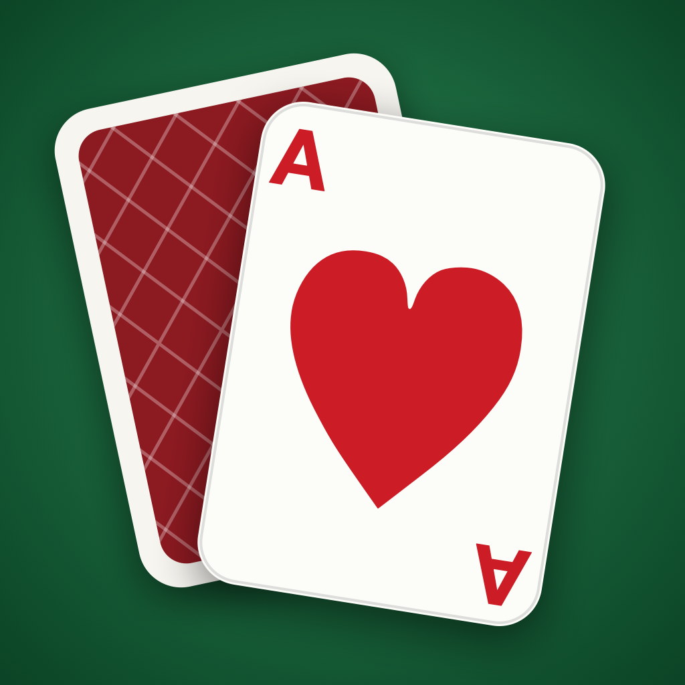

# Solitaire

[](https://github.com/RobertLib/solitaire/actions/workflows/tests.yml)

Classic Klondike solitaire for iPhone and iPad — written in Swift and SwiftUI,
fully offline, no ads, no dependencies.



## Features

- **Complete Klondike rules** — 7 tableau columns, 4 foundations, stock and
  waste piles, card flipping, moving face-up runs as a group.
- **Draw 1 or Draw 3** (with a fan of the last three waste cards).
- **Three scoring modes**
  - *Standard* (Windows-style) — +10 per card moved to a foundation, +5 for
    turning over a card or playing waste-to-column, −15 for taking a card
    back off a foundation, −2 every 10 seconds, and a 700,000 / seconds time
    bonus on winning. Turning the deck over costs −100 a pass on draw 1 and
    −20 on draw 3, charged from the pass at which the deck has been seen in
    full and the player is going round again — the second and the fourth.
  - *Vegas* — buy the deck for $52, earn $5 per foundation card, limited
    passes through the stock (1 pass on draw-1, 3 passes on draw-3), with an
    optional cumulative balance across games.
  - *No scoring.*
- **Drag & drop and tap-to-move** — tapping a card sends it to the best legal
  spot; while dragging, the valid drop target lights up.
- **Undo** covering the whole game — and surviving a relaunch, so a deal
  reopened at a dead end can still be walked back — plus **move hints** (tap
  repeatedly to cycle suggestions) and a **magic-wand auto-finish** once the win
  is guaranteed.
- **Dead-end detection** — when a deal runs out of legal moves the board says
  so and offers a way out, instead of leaving you to work it out.
- **Animations** — staggered dealing, 3-D card flips, and a victory cascade
  of bouncing cards with confetti.
- **Sounds synthesised at runtime** (no audio assets) and haptic feedback.
- **Statistics** — games played and won, streaks and Vegas balance, plus best
  time / fewest moves / best score kept separately for draw 1 and draw 3, which
  are different games and would otherwise share a table the easier one always
  tops.
- **Game persistence** — close the app and the deal resumes where you left
  off, undo history and all. Every deal has a number and can be replayed.
- **Appearance** — 4 table themes, 4 card backs, a left-handed layout, and
  layouts tuned for portrait, landscape, and iPad (cards stop growing past a
  comfortable size on a big screen, and the board stays centred).
- **Accessibility** — VoiceOver labels and hints on every pile and card, with
  each card's legal destinations offered by name ("Move to column 3") so a
  reader can choose a pile rather than being limited to the one tap-to-move
  picks, HUD text that follows the reader's Dynamic Type size, and full
  **Reduce Motion** support: the deal lands instead of flying in, cards move
  without sliding, panels fade instead of growing, the hint ring holds still,
  and the victory cascade gives way to the results screen on its own.
- **English and Czech**, chosen by the system language with no in-app setting:
  Czech on a Czech device, English everywhere else. Every string goes through
  `String(localized:)` into `Localizable.xcstrings`, plural forms included, so a
  further language needs no code.

## Architecture

```
solitaire/
├── Models/            pure game logic, no UI imports (testable standalone)
│   ├── Card.swift          cards, suits, ranks, seeded RNG
│   ├── GameState.swift     game state, rules, dealing, auto-finish
│   ├── StatePacking.swift  a board in 65 bytes, for the saved undo history
│   ├── MoveAdvisor.swift   hints, tap-to-move targets, the autoplay bot
│   ├── SavedGame.swift     the resume snapshot and its validation
│   ├── Scoring.swift       Standard and Vegas scoring
│   ├── TimeFormat.swift    the one game clock format
│   ├── GameSettings.swift  user preferences (UserDefaults)
│   └── Statistics.swift    persistent statistics
├── GameViewModel.swift    game flow: moves, undo, hints, timer, persistence
├── Localizable.xcstrings  String Catalog (en, cs)
├── InfoPlist.xcstrings    the localised app name
├── PrivacyInfo.xcprivacy  privacy manifest (UserDefaults, required reason)
├── Views/
│   ├── CardView.swift     card rendering (pips, court cards, backs, flip)
│   ├── BoardLayout.swift  layout math (portrait / landscape / iPad)
│   ├── BoardView.swift    interactive board, drag & drop, hit testing
│   ├── HUDViews.swift     top status bar, bottom controls
│   ├── WinView.swift      victory screen, cascade, confetti
│   └── …                  menu, settings, statistics, help
└── Support/               themes, sounds, haptics, strings, Reduce Motion
```

## Tests

Two harnesses, one set of assertions.

```sh
./Tests/run.sh     # engine suites, no Xcode, no simulator — about a minute
```

```
⌘U                 # the same suites plus everything that needs a running app
```

`Tests/EngineTests.swift` holds the assertions and is compiled by both: the
script builds it straight against the sources, and the `solitaireTests` target
builds it against the app. Neither can drift from the other. Everything the
script compiles builds for macOS — `Models/` imports nothing but Foundation, and
`BoardLayout` needs SwiftUI only for its geometry types — so it needs no
simulator, and it runs the full 400-deal fuzz optimised. ⌘U builds the same code
into the app module unoptimised, where that sweep would take three minutes, so
it takes a 50-deal slice instead.

The suites cover the rules, dealing, runs, recycling, scoring, dead ends,
auto-finish, the suggested-move list, the resume snapshot and its packed undo
history, the clock, preferences and statistics, and the board layout on every
form factor (including the sizes a `GeometryReader` reports mid-rotation). The
fuzz plays 400 deals, asserting the board invariants after every single move —
52 distinct cards, valid foundations, valid tableau runs, no face-up card ever
buried — and holds the hint list and the dead-end banner to the same answer on
every position it reaches, so the game can never announce that a deal is dead
while a hint is still waiting to be given. Sampled across those positions, it
also holds the destinations offered to VoiceOver to the moves a drag would
allow, so the two ways of moving a card can never diverge.

`solitaireTests/` adds what only a running app can reach: undo against a live
clock, the saved game across a relaunch, the Vegas ledger, statistics
bookkeeping, and the wand playing a deal out. Each case runs against a scratch
`UserDefaults` suite, so a test run never touches real preferences.

Both run on every push and pull request — see
[`.github/workflows/tests.yml`](.github/workflows/tests.yml). The engine job
needs only a toolchain and no simulator; the app job builds the project,
boots a simulator and drives it. Both pin `macos-26`, the only runner image
whose default Xcode is new enough to build this project at all; a failing app
job uploads its `.xcresult` as an artifact, which anyone can download without
the admin rights the raw job logs require.

## App Store

Everything the submission needs is in [`AppStore/`](AppStore/): the listing texts
for `en-US`, `en-GB` and `cs`, the privacy policy, the note for the reviewer, and
[`alternatives.md`](AppStore/alternatives.md) — the competition, the keyword
research behind the copy in use, and what to change first if it under-performs.

The screenshots and the App Preview are *made*, not kept:

```sh
Tools/appstore_media.sh              # 8 screenshots and a preview, per locale
Tools/appstore_captions.sh           # paints the captions onto them
```

Both are driven by `-shot <name>`, handled in
[`Support/ScreenshotScenes.swift`](solitaire/Support/ScreenshotScenes.swift),
which is `#if DEBUG` and reaches no App Store build. Nothing in the set is mocked
up: every shot is a numbered deal played forward by the app's own move advisor,
so the score, the clock and the move count on it are the ones the deal actually
earned, and a pose that stops being legal stops rendering rather than quietly
drifting away from the game. The seeds were chosen by compiling the engine on its
own — the same trick `Tests/run.sh` uses — and playing it through hundreds of
thousands of deals: the dead-end shot needed one of the two deals in two hundred
thousand that the advisor plays to a position with no legal move left and a score
still on the board. See [`AppStore/screenshots.md`](AppStore/screenshots.md).

## Building

Open `solitaire.xcodeproj` in Xcode 26+ and run on iOS 17+. Xcode 26 is a floor
rather than a preference: the project builds with Swift 6.2's default actor
isolation (`SWIFT_DEFAULT_ACTOR_ISOLATION`, and `-default-isolation` in
`Tests/run.sh`), which earlier toolchains do not have. iOS 17 remains the
deployment target — that is what the app runs on, not what it is built with.

The simulator and the tests need nothing else; to run on a device, put your team
in a `Local.xcconfig` next to `Signing.xcconfig` (it is git-ignored, so the
project carries nobody's team but yours):

```
DEVELOPMENT_TEAM = ABCDE12345
```

## License

[MIT](LICENSE).
